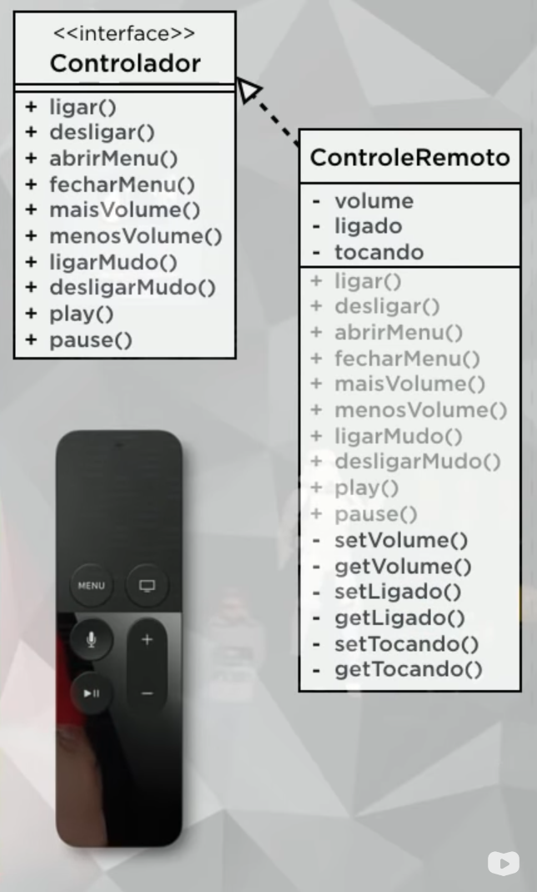
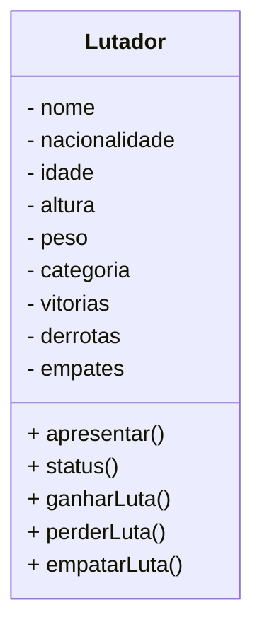
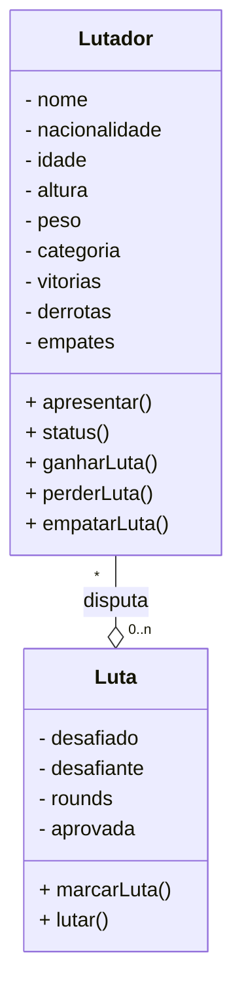
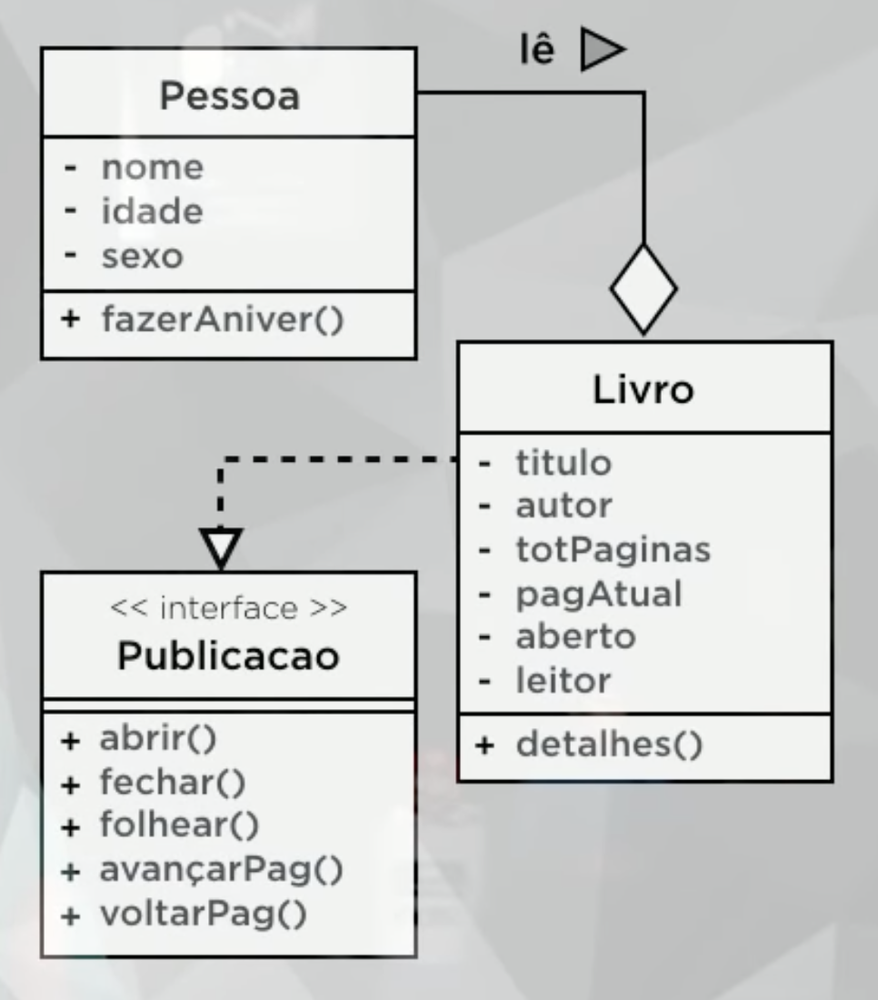
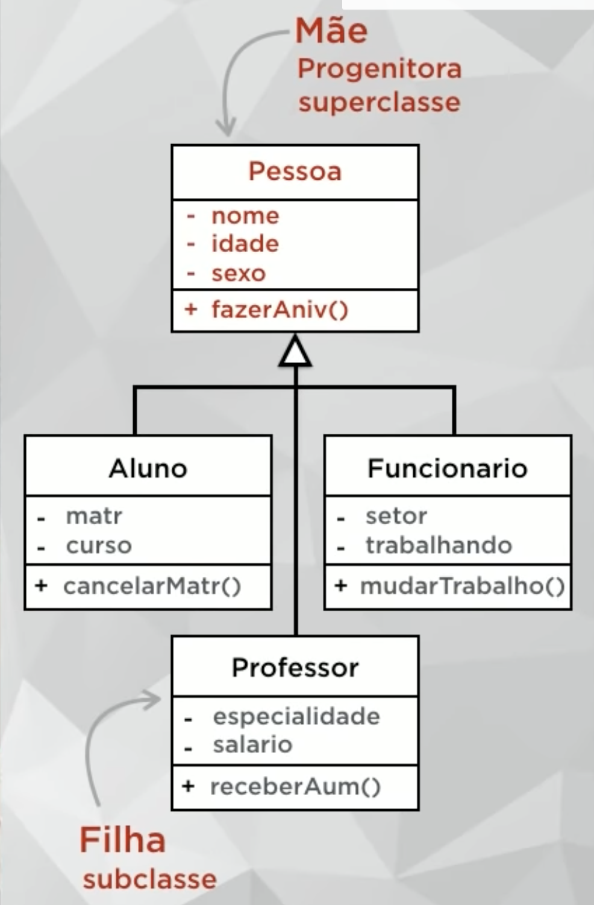

# Programação Orientada a Objetos - JAVA

[Link da Playlist](https://youtube.com/playlist?list=PLHz_AreHm4dkqe2aR0tQK74m8SFe-aGsY)

## Tabela de Conteúdo

- [01a - O que é Programação Orientada a Objetos](#01a---o-que-é-programação-orientada-a-objetos)
- [01b - Instalando o JDK e NetBeans](#01b---instalando-o-jdk-e-netbeans)
- [02a - O que é um Objeto?](#02a---o-que-é-um-objeto)
- [02b - Criando Classes e Objetos em Java](#02b---criando-classes-e-objetos-em-java)
- [03a - O que é Visibilidade em um Objeto?](#03a---o-que-é-visibilidade-em-um-objeto)
- [03b - Configurando Visibilidade de Atributos e Métodos](#03b---configurando-visibilidade-de-atributos-e-métodos)
- [04a - Métodos Especiais](#04a---métodos-especiais)
- [04b - Métodos Getter, Setter e Construtor](#04b---métodos-getter-setter-e-construtor)
- [05a - Exemplo Prático com Objetos](#05a---exemplo-prático-com-objetos)
- [05b - Exemplo Prático em Java](#05b---exemplo-prático-em-java)
- [06a - Pilares da POO: Encapsulamento](#06a---pilares-da-poo-encapsulamento)
- [06b - Encapsulamento](#06b---encapsulamento)
- [07a - Relacionamento entre Classes](#07a---relacionamento-entre-classes)
- [07b - Objetos Compostos em Java](#07b---objetos-compostos-em-java)
- [08a - Relacionamento de Agregação](#08a---relacionamento-de-agregação)
- [08b - Agregação entre Objetos com Java](#08b---agregação-entre-objetos-com-java)
- [09a - Exercícios de POO](#09a---exercícios-de-poo)
- [09b - Exercício prático POO em Java](#09b---exercício-prático-poo-em-java)
- [10a - Herança (Parte 1)](#10a---herança-parte-1)
- [10b - Herança (Parte 1)](#10b---herança-parte-1)
- [11a - Herança (Parte 2)](#11a---herança-parte-2)
- [11b - Herança (Parte 2)](#11b---herança-parte-2)
- [12a - Conceito Polimorfismo (Parte 1)](#12a---conceito-polimorfismo-parte-1)
- [12b - Polimorfismo em Java (Parte 1)](#12b---polimorfismo-em-java-parte-1)
- [13a - Conceito Polimorfismo (Parte 2)](#13a---conceito-polimorfismo-parte-2)
- [13b - Polimorfismo Sobrecarga (Parte 2)](#13b---polimorfismo-sobrecarga-parte-2)
- [14a - Exercícios de POO (Parte 2)](#14a---exercícios-de-poo-parte-2)
- [14b - Projeto Final em Java (Parte 1)](#14b---projeto-final-em-java-parte-1)
- [15a - Exercícios de POO (Parte 3)](#15a---exercícios-de-poo-parte-3)
- [15b - Projeto Final em Java (Parte 2)](#15b---projeto-final-em-java-parte-2)

## 01a - O que é Programação Orientada a Objetos

## 01b - Instalando o JDK e NetBeans

## 02a - O que é um Objeto?

[Código fonte](./src/aula02/)

## 02b - Criando Classes e Objetos em Java

## 03a - O que é Visibilidade em um Objeto?

## 03b - Configurando Visibilidade de Atributos e Métodos

## 04a - Métodos Especiais

## 04b - Métodos Getter, Setter e Construtor

## 05a - Exemplo Prático com Objetos

### Exercício de Algorítmo

Construa a classe ContaBanco em algoritmo no arquivo [ContaBanco.txt](./src/aula05/ContaBanco.txt) de acordo com a figura abaixo:

## 05b - Exemplo Prático em Java

## 06a - Pilares da POO: Encapsulamento

### Exercício de Algorítmo

Construa a interface Controlador no arquivo [Controlador.txt](./src/aula06/Controlador.txt) e a classe ControleRemoto no arquivo [ControleRemoto.txt](./src/aula06/ControleRemoto.txt) de acordo com a UML abaixo:

## 06b - Encapsulamento

## 07a - Relacionamento entre Classes

### Classe Lutador

No arquivo [Lutador.txt](./src/aula07/Lutador.txt) escreva a classe em algoritmo de acordo com a UML abaixo:

### Lutadores

No arquivo [Principal.txt](./src/aula07/Principal.txt) escreva a o programa que irá usar a classe Lutador em forma de algoritmo de acordo com os lutadores abaixo:

|NOME|NACIONALIDADE|IDADE|ALTURA|PESO|CATEGORIA|VITORIAS|DERROTAS|EMPATES|
| :-: | :-: | :-: | :-: | --- | :-: | :-: | :-: | :-: |
| Pretty Boy :sunglasses:| França :fr:| 31 | 1.75 m | 68.9 Kg | Leve | 11 | 2 | 1 |
| Putscript :angry:| Brasil :brazil:| 29 | 1.68 m | 57.8 Kg | Leve | 14 | 2 | 3 |
| Snapshadow :grimacing:| EUA :us:| 35 | 1.65 m | 80.9 Kg | Médio | 12 | 2 | 1 |
| Dead Code :skull:| Austrália :australia:| 28 | 1.93 m | 81.6 Kg | Médio | 13 | 0 | 2 |
| Ufocobol :alien: | Brasil :brazil:| 37 | 1.70 m | 119.3 Kg | Pesado | 5 | 4 | 3 |
| Nerdaard :nerd_face:| EUA :us:| 30 | 1.81 m | 105.7 Kg | Pesado | 12 | 2 | 4 |

## 07b - Objetos Compostos em Java

## 08a - Relacionamento de Agregação

### Classe Luta

No arquivo [Luta.txt](./src/aula08/Luta.txt) escreva a classe em algoritmo de acordo com a UML abaixo:

### Regras da Luta

- Só pode ser marcada entre lutadores da mesma categoria.
- Desafiado e desafiante devem ser lutadores diferentes.
- Só pode acontecer se estiver aprovada.
- Só pode ter como resultado a vitória de um dos lutadores ou o empate.

## 08b - Agregação entre Objetos com Java

## 09a - Exercícios de POO

## 09b - Exercício prático POO em Java

## 10a - Herança (Parte 1)

Crie as classes em algoritmo nos arquivos da pasta [src/aula10](./src/aula10/) seguindo os diagramas abaixo:

## 10b - Herança (Parte 1)

## 11a - Herança (Parte 2)

## 11b - Herança (Parte 2)

## 12a - Conceito Polimorfismo (Parte 1)

## 12b - Polimorfismo em Java (Parte 1)

## 13a - Conceito Polimorfismo (Parte 2)

## 13b - Polimorfismo Sobrecarga (Parte 2)

## 14a - Exercícios de POO (Parte 2)

## 14b - Projeto Final em Java (Parte 1)

## 15a - Exercícios de POO (Parte 3)

## 15b - Projeto Final em Java (Parte 2)

